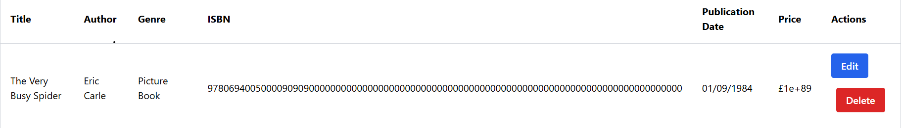

# Library System E2E Test Suite

Playwright E2E test suite for the Library Management System.

## Quick Start

### Installation

```bash
npm install
npx playwright install
```

## How to Run Tests

### 1. Wait for Server

**Important**: Always wait for the server to be ready before running tests (hosted app may be sleeping):

```bash
npm run wait-for-server
```

### 2. Run Tests

```bash
# Run all tests
npm test

# Run with visible browser (for debugging)
npm run test:headed

# Interactive test runner
npm run test:ui

# View test reports
npm run report
```

## Test Application

- **URL**: <https://frontendui-librarysystem.onrender.com>  
- **Login**: admin / admin

---

### I notice the logout didn't redirect to the login page

### The login page can only be reached  manually once you have clicked on Log Out button

---

### On the edit book page, I observed  there are no formal check on boundary values or  for the ISBN and Price fields



```
